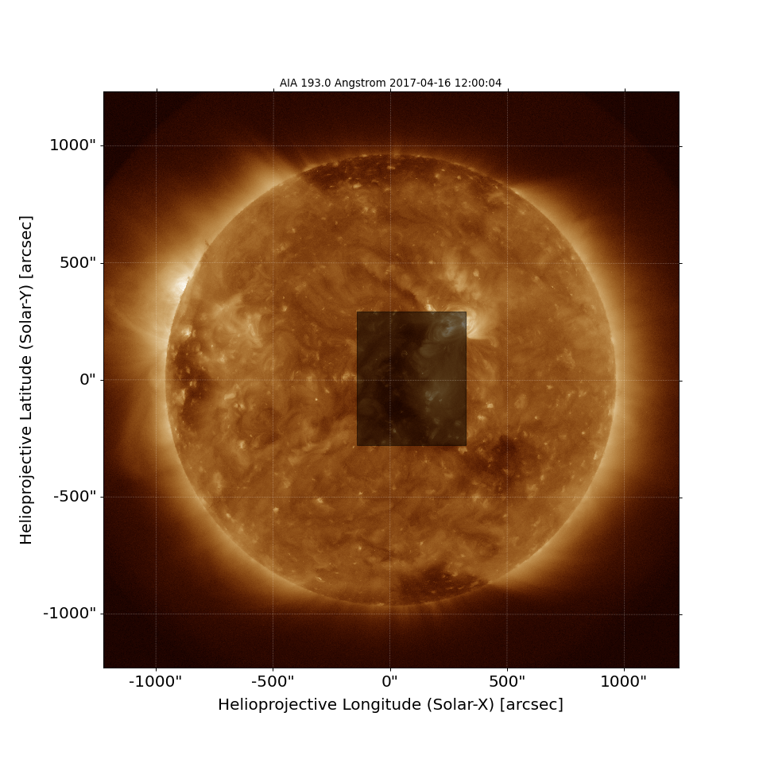
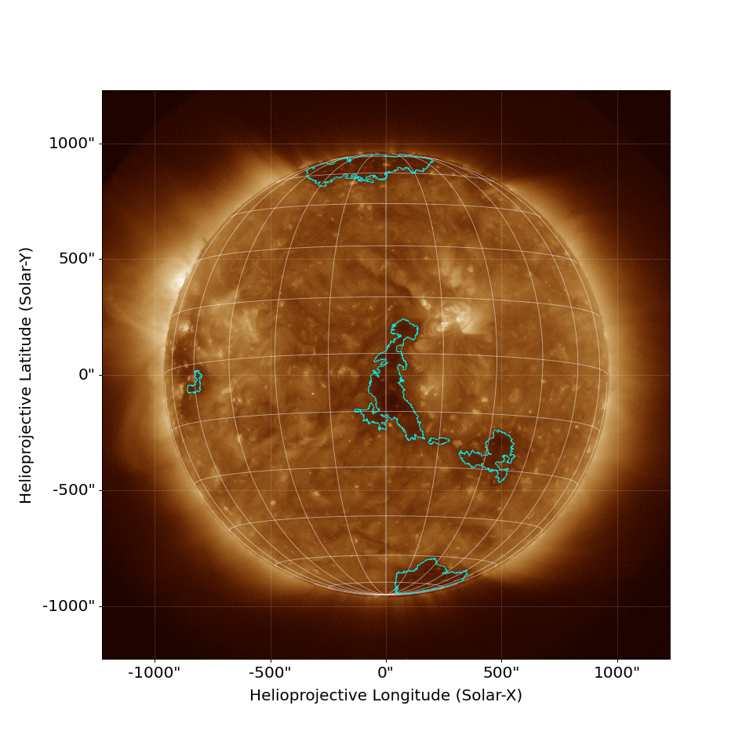
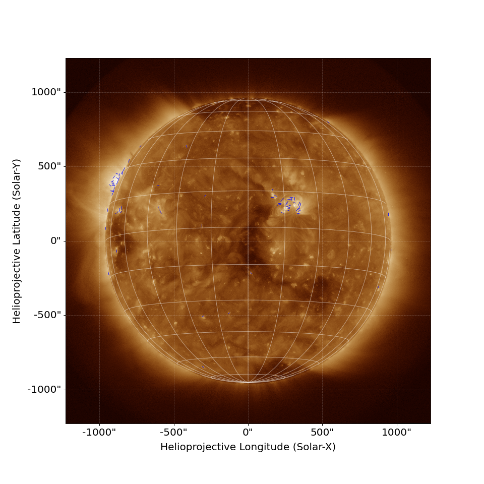
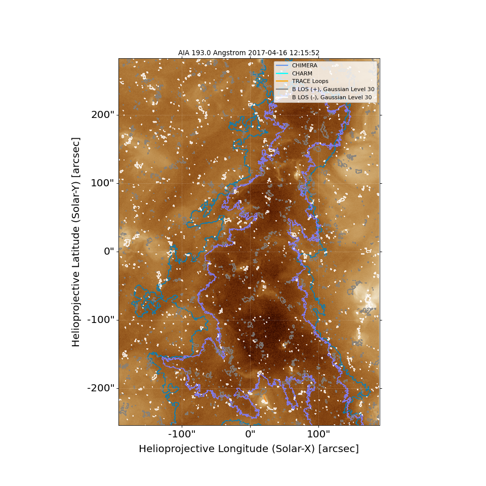
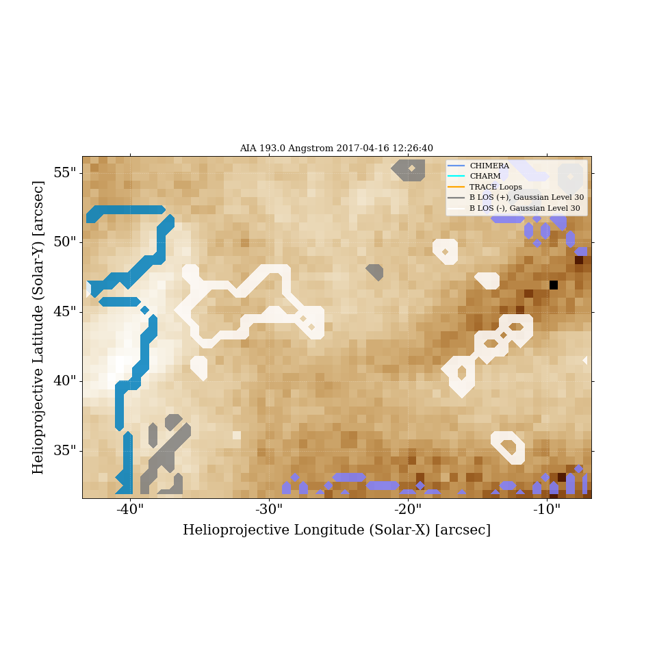
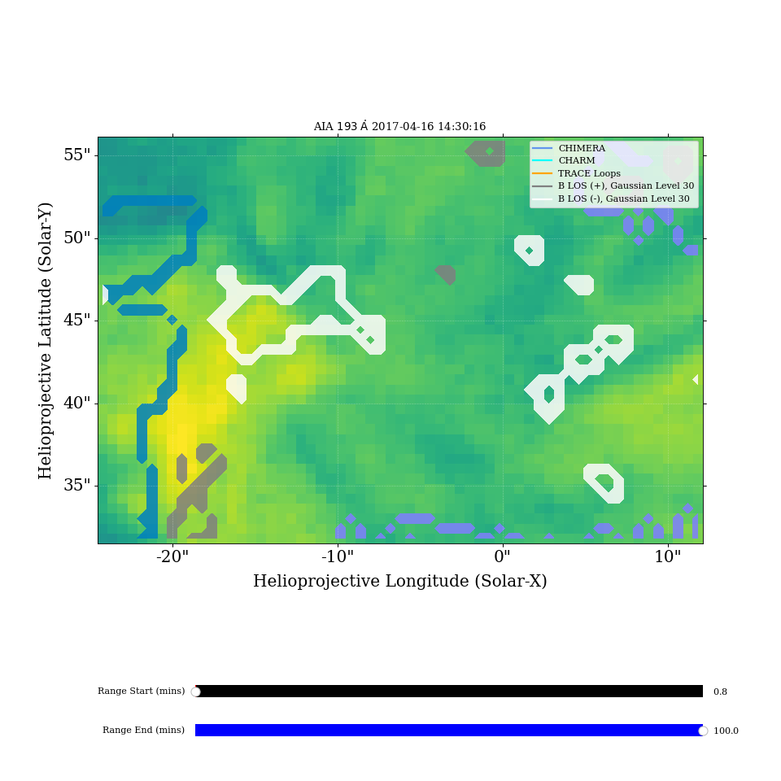
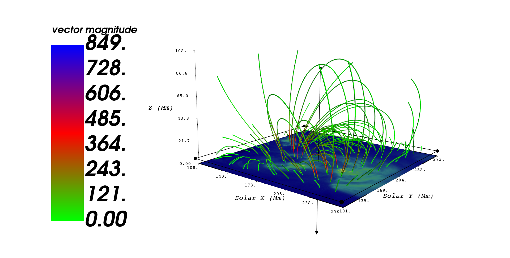

Python library combining multiple solar analysis methods into one convenient package.

Features a variety of methodologies commonly used to analyse and identify features, events, and statistics of solar data.

Linux and Windows distributions are currently supported. The only supported telescopes are the AIA and HMI instuments onboard the SDO.

# **Installation**

Users may download the repository and solve for the dependencies. Works best with Python Anaconda, and it is recommended to start off in a clean anaconda enviornment and solve for the dependencies one at a time.

# **Usage**
Several programs are built directly within the main directory of Solar_Analysis_Toolkit. To use these programs, just simply call the program name and input data when prompted. The reccomended order of running programs is as follows :

If you don't already have data such as a time series, call Create_AIA_Time_Series.py and build a time series using the JSOC cutout service over an area of interest. If you do however have a time series segmented by individual .fits files, you may skip this part and reference them when running other analysis or identification methods.

Once a data set of interest has been obtained, multiple solar event identification methods are built into the toolkit, examples being Identify_CHARM_CH_Boundary.py, Identify_HMI_Magnetogram_Network_Boundary.py, and Identify_TRACE_Coronal_Loops.py to name a few. Calling these files will prompt the user to identify either a time of interest, or a data set of interest, with which the identification method will use to identify solar features or events.

 

Alongside solar event identification methods being included in the Toolkit, solar analysis methods such as Multifractal Detrended Fluctuation Analysis (MF-DFA) and Solarbextrapolation's Potential Field Extrapolation are included. These allow for analysis of solar data in quick and easy to use programs. Examples are shown below.

 

Future versions work to improve functionality and useability of the Toolkit, as well as including more solar instruments, event identification methods, and analysis methods.

If you have an identification method, analysis method, or contributions that you would like added to the toolkit, feel free to email me at landonryanwells@gmail.com. I am always looking for suggestions on improvement to the Toolkit.
